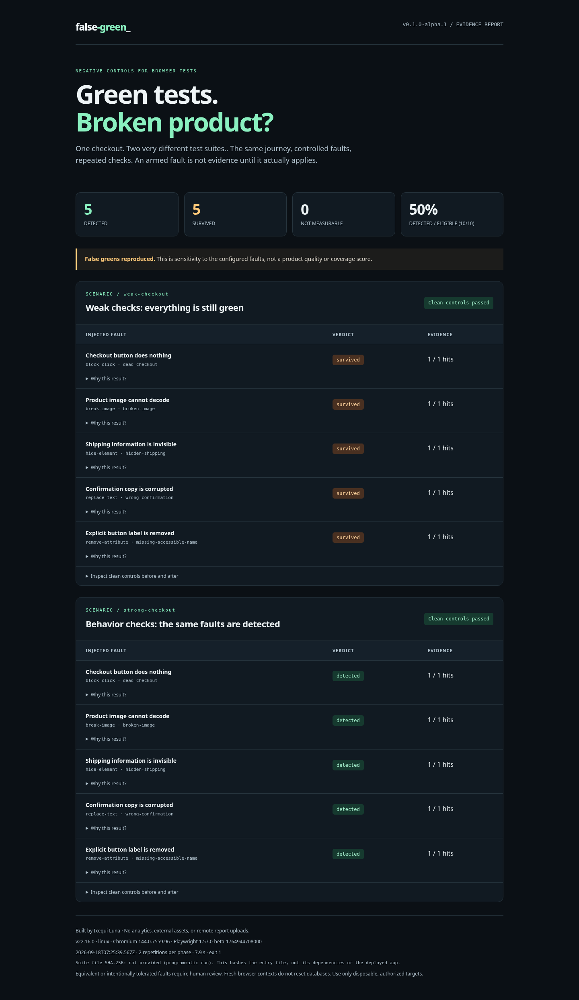

# false-green

### Break the product. Challenge the green.

**Evidence-aware fault testing for browser journeys.**

A passing test is not necessarily a sensitive test. `false-green` deliberately breaks a configured behavior, replays the same journey, and checks whether verification notices. It will not call a fault a survivor unless the injector observed an actual application.

**Alpha · TypeScript · Playwright Chromium · MIT · English / [Español](README.es.md)**



## The demo in one sentence

**Five browser faults survive weak checks. The same five are detected by behavior checks.** Every fault runs twice, with two clean controls before and two after each scenario. The demo contains a synthetic checkout, not a real payment integration.

| Fault | Weak verification | Behavior verification |
|---|---|---|
| Checkout click is swallowed | `button.count() === 1` | Confirmation becomes visible |
| Image is corrupted | `img.complete` | `img.complete && img.naturalWidth > 0` |
| Shipping information is hidden | Element exists | Element is visible |
| Confirmation copy is wrong | Confirmation node exists | Exact success message |
| Explicit button label is removed | Button exists | Declared `aria-label` contract |

The last case checks an **explicit-label product contract**, not a complete accessibility audit. The button can still have an accessible name from its visible text.

## Run the proof

Node.js 22+ and Chromium are required. From a downloaded archive or source checkout:

```bash
npm ci
npx playwright-core install chromium
npm run demo
```

Open `false-green-report/index.html`. JSON and Markdown are written alongside it. After dependencies and Chromium are installed, the default demo requires **no target HTTP server or external assets**; it uses an in-memory HTML fixture in a real browser.

Using an installed Chromium instead:

```bash
FALSE_GREEN_CHROMIUM_PATH=/path/to/chromium npm run demo
```

The demo script succeeds only after asserting exactly **5 survivors + 5 detections + valid clean controls**. This is different from a campaign exit code: finding survivors returns `1`.

## Reproduced locally on September 19, 2026

Clean registry installation with the committed lockfile: **71 unit + 18 offline browser + 20 HTTP integration tests passed** on Windows with Node 24.15.0, Playwright Core 1.56.1 and its Chromium 141.0.7390.37. The synthetic demo reproduced five survivors and five detections. This is local evidence, not a hosted CI result or a guarantee about other applications. See [verification details](docs/VERIFICATION-2026-09-19.md).

## What exists today

A standalone CLI and programmatic runner; repeated clean controls; seven fault kinds; fresh browser contexts; per-trial activation evidence; explicit invalid/unstable states; exact-origin HTTP request filtering; HTML, JSON and Markdown reports; a working offline demo; a separate HTTP fixture; automated tests and a CI workflow.

**This alpha is not a drop-in `@playwright/test` plugin.** Extract reusable Playwright journeys into the `exercise` and `verify` functions below. A native fixture/reporter adapter is a roadmap item, not a shipped capability. No source-code AST mutation or automatic fault discovery is claimed.

## Bring a journey

Create `false-green.suite.mjs` in this source checkout:

```js
import { defineSuite, eventually } from './dist/index.js';

export default defineSuite({
  name: 'Save profile',
  baseURL: 'http://127.0.0.1:3000',
  repetitions: 2,
  scenarios: [{
    id: 'save-profile',
    title: 'Saving must produce a confirmation',
    exercise: async ({ page, baseURL }) => {
      await page.goto(`${baseURL}/profile`);
      await page.locator('[data-testid="save"]').click();
    },
    verify: async ({ page, signal }) => {
      await eventually(
        () => page.getByText('Profile saved', { exact: true }).isVisible(),
        'Saving must display the success confirmation',
        { timeoutMs: 1500, signal },
      );
    },
    mutations: [{
      id: 'dead-save',
      title: 'Save button does nothing',
      kind: 'block-click',
      selector: '[data-testid="save"]',
    }],
  }],
});
```

```bash
npm run build
node dist/cli.js --suite ./false-green.suite.mjs --out ./artifacts/profile
```

Use `check`, `eventually`, or `node:assert/strict` **inside `verify`**. An assertion thrown during `exercise`, a generic exception, a failed navigation, or a total trial timeout is **inconclusive**, not a credited detection. This deliberately conservative boundary reduces false attribution.

## Fault catalog

| Kind | Target | Observed application |
|---|---|---|
| `block-click` | CSS selector | Matching click is prevented and propagation stopped |
| `replace-text` | CSS selector + `value` | Text actually changes |
| `hide-element` | CSS selector | Inline display is changed to `none !important` |
| `remove-attribute` | CSS selector + `attribute` | An existing attribute is removed |
| `break-image` | CSS selector **or** exact URL `path` | Image source is corrupted or its HTTP response replaced |
| `route-response` | Exact pathname + optional method | Configured response is fulfilled |
| `route-abort` | Exact pathname + optional method | Matching browser request is aborted |

URL-path faults require HTTP fixtures. CSS image corruption is intended for ordinary `` elements, not every responsive `<picture>` arrangement. Selectors are CSS, not Playwright selector syntax. Network paths are exact; no globs, query matching, or regular expressions. See [API](docs/API.md).

## Six verdicts, no convenient omissions

| Verdict | Meaning |
|---|---|
| `detected` | Fault applied and a verification assertion failed in every repetition |
| `survived` | Fault applied and verification passed in every repetition |
| `not-exercised` | No application observed; not a survivor and not a kill |
| `unstable` | Repetitions disagree on activation or result |
| `inconclusive` | Journey, timeout, injector or environment error |
| `baseline-invalid` | Clean controls failed before or after the campaign |

Detection rate = `detected / (detected + survived)`. A zero denominator is `null`, never `100%`. Reports show the eligible fraction. Unexercised or unresolved cases force exit `2`, even when other faults are detected.

| CLI exit | Meaning |
|---|---|
| `0` | Every configured fault was stably detected |
| `1` | Stable survivors exist, with no unresolved cases |
| `2` | Invalid configuration, infrastructure error or incomplete experiment |

**This is sensitivity to chosen faults, not code coverage, product correctness, or proof of causality.** A survivor can be an intentionally tolerated or equivalent fault. Review it. Two repetitions expose some instability; they do not establish a statistical guarantee.

## Development

```bash
npm run check        # strict TypeScript
npm test             # unit tests + real-browser offline tests
npm run demo         # assert the documented contrast
npm run test:http    # additional real HTTP/network integration tests
```

`npm run verify` runs build, unit/offline browser tests and demo. CI additionally runs the HTTP tests. The initial local evidence and environment limitations are recorded in [BUILD_VERIFICATION](docs/BUILD_VERIFICATION.md); the presence of a workflow is **not** a claim that remote CI has run.

## Safety and limitations

Use disposable, authorized local or staging targets. Loopback origins are the default. Remote HTTP origins require an explicit opt-in. Browser request filtering is **not a sandbox**: it does not control Node code, APIRequestContext, backend requests, WebSockets, external processes, or later user-added routes. Never use real payment or clinical data.

Fresh contexts isolate browser storage, not databases. Provide `reset` for external state. Reports do not collect request bodies, cookies, screenshots or traces, but custom assertion messages can still contain sensitive data. Inspect reports before sharing. No analytics or report upload is built in.

See [architecture](docs/ARCHITECTURE.md), [security](SECURITY.md), [roadmap](docs/ROADMAP.md), [contributing](CONTRIBUTING.md), and [publication](docs/PUBLISHING.md).

## Related work

[Stryker](https://stryker-mutator.io/docs/) mutates program source. `false-green` focuses on explicitly configured observable browser faults and evidence-aware interpretation. They are complementary, not interchangeable. [Playwright](https://playwright.dev/docs/api/class-browsercontext) supplies the browser automation, routing and isolated contexts.

## Author and license

Created for **Ixequi Luna**. MIT licensed. The npm package is intentionally marked private in this alpha; **no npm publication or package-name availability is claimed**.
